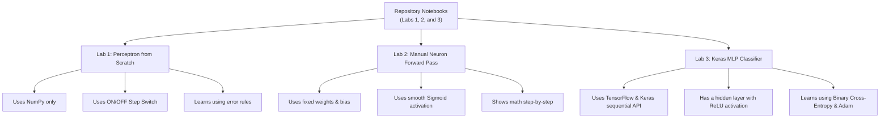

# Artificial Neural Networks (ANN) & Deep Learning Lab
## Conceptual Reference Guide: Labs 1, 2, and 3

This repository contains Jupyter Notebooks that guide you through building and understanding neural networks. We start with a basic Perceptron built from scratch, move to a single neuron with a smooth activation function, and finally build a complete Feedforward Neural Network using TensorFlow/Keras.

- **Lab 1 Notebook**: [ANN_lab1.ipynb](file:///Users/mastersam/Documents/5BDA/ANN&DL/code/ANN_lab1.ipynb) — Perceptron from scratch using NumPy.
- **Lab 2 Notebook**: [ANN_lab2.ipynb](file:///Users/mastersam/Documents/5BDA/ANN&DL/code/ANN_lab2.ipynb) — Single neuron forward pass with Sigmoid activation.
- **Lab 3 Notebook**: [ANN_lab3.ipynb](file:///Users/mastersam/Documents/5BDA/ANN&DL/code/ANN_lab3.ipynb) — Multi-Layer Perceptron using TensorFlow/Keras.

All three labs use the logical **AND gate** as the dataset.

> [!NOTE]
> For a very simple version with stories and analogies, check out the [Super Simple ELI5 Guide](file:///Users/mastersam/Documents/5BDA/ANN&DL/code/explaination.md).

---

## 📌 Table of Contents
1. [Notebook Overview](#-notebook-overview)
2. [Lab 1: Perceptron from Scratch (NumPy)](#-lab-1-perceptron-from-scratch-numpy)
   - [Conceptual Foundations](#lab-1-conceptual-foundations)
   - [How It Learns](#lab-1-how-it-learns)
   - [Code Breakdown](#lab-1-code-breakdown)
3. [Lab 2: Single Neuron Forward Pass (Sigmoid)](#-lab-2-single-neuron-forward-pass-sigmoid)
   - [Conceptual Foundations](#lab-2-conceptual-foundations)
   - [Step-by-Step Hand Calculations](#lab-2-step-by-step-hand-calculations)
   - [Code Breakdown](#lab-2-code-breakdown)
4. [Lab 3: Feedforward Neural Network (TensorFlow/Keras)](#-lab-3-feedforward-neural-network-tensorflowkeras)
   - [Conceptual Foundations](#lab-3-conceptual-foundations)
   - [Layers & Trainable Parameters](#lab-3-layers--trainable-parameters)
   - [Loss & Optimizers Made Simple](#lab-3-loss--optimizers-made-simple)
   - [Code Breakdown](#lab-3-code-breakdown)
5. [🎓 The Viva Q&A Guide (20+ Conceptual Questions)](#-the-viva-qa-guide-20-conceptual-questions)

---

## 🗺️ Notebook Overview

The three labs show different ways to build and train network models:



---

## 🧠 Lab 1: Perceptron from Scratch (NumPy)

### Lab 1: Conceptual Foundations
A **Perceptron** is the simplest form of a neural network, introduced by Frank Rosenblatt in 1958. It is a **linear classifier**, meaning it separates data using a single straight line.

- **Inputs**: The data coordinates or features (for the AND gate, these are two binary inputs: `0` or `1`).
- **Weights**: The importance or strength given to each input.
- **Bias**: The threshold or "natural grumpiness" of the neuron. It decides how easy or hard it is for the neuron to activate.
- **Step Activation Function**: A sharp ON/OFF switch. If the net score (inputs multiplied by weights, plus bias) is 0 or positive, it outputs `1`. If the score is negative, it outputs `0`.

**Limitation**: A Perceptron can only solve problems that are **linearly separable** (where a single straight line can separate the two classes). Logical AND, OR, and NAND gates can be separated by a line. Logical XOR and XNOR gates cannot, so a single Perceptron fails to solve them.

### Lab 1: How It Learns
1. **Weighted Sum**: The Perceptron multiplies each input by its weight and adds the bias to get a single score.
2. **Activation**: The score is passed through the ON/OFF Step function to get a predicted class (`0` or `1`).
3. **Weight Update Rule**: If the prediction is wrong, we calculate the error (`target - prediction`). We then adjust the weights and bias by a small step size called the **learning rate** (often written as `0.1` or `0.01`). If the prediction is correct, no changes are made.

### Lab 1: Code Breakdown

* **Step Function**:
  ```python
  def step_function(x):
      if x >= 0:
          return 1
      return 0
  ```
  Returns `1` if the net input is zero or positive, else returns `0`.

* **Constructor (`__init__`)**:
  ```python
  def __init__(self, input_size, learning_rate=0.1):
      self.weights = np.zeros(input_size)
      self.bias = 0
      self.learning_rate = learning_rate
  ```
  Sets up the Perceptron. Weights and bias start at zero. The learning rate is set to `0.1` so weight updates are done in small, controlled steps.

* **Prediction (`predict`)**:
  ```python
  def predict(self, x):
      total = np.dot(x, self.weights) + self.bias
      return step_function(total)
  ```
  Multiplies inputs by weights (dot product), adds bias, and passes the total to the ON/OFF switch.

* **Training (`train`)**:
  ```python
  def train(self, X, y, epochs=10):
      for _ in range(epochs):
          for inputs, target in zip(X, y):
              prediction = self.predict(inputs)
              error = target - prediction
              self.weights += self.learning_rate * error * inputs
              self.bias += self.learning_rate * error
  ```
  Runs through the dataset for a set number of rounds (`epochs`). For each sample, it checks the prediction, calculates the error, and adjusts weights and bias if the prediction was wrong.

---

## 🔢 Lab 2: Single Neuron Forward Pass (Sigmoid)

### Lab 2: Conceptual Foundations
This lab demonstrates **forward propagation** (how data flows forward through a network) using fixed settings. Instead of training the neuron, we hardcode the weights and bias to show how the math works.

- **Sigmoid Activation**: A smooth "dimmer switch" instead of a sharp ON/OFF step function. It outputs a decimal value between `0` and `1`. This output represents the probability or confidence of the classification (e.g., `0.57` means "57% confident the answer is 1").
- **Thresholding**: To make a final binary prediction, we check if the sigmoid output is `0.5` or higher. If it is, we classify it as `1`; otherwise, it is `0`.

### Lab 2: Step-by-Step Hand Calculations
Using these fixed parameters from the lab:
- Weights: `[0.5, 0.5]`
- Bias: `-0.7`

Here is how the neuron processes each input of the AND gate:

| Input ($x_1, x_2$) | Weighted Sum ($z$) | Sigmoid Formula Output ($\frac{1}{1 + e^{-z}}$) | Final Prediction (Is Output $\ge 0.5$?) |
| :--- | :--- | :--- | :--- |
| **[0, 0]** | $(0 \times 0.5) + (0 \times 0.5) - 0.7 = \mathbf{-0.7}$ | $\frac{1}{1 + e^{0.7}} = \mathbf{0.3318}$ | **0** (since $0.3318 < 0.5$) |
| **[0, 1]** | $(0 \times 0.5) + (1 \times 0.5) - 0.7 = \mathbf{-0.2}$ | $\frac{1}{1 + e^{0.2}} = \mathbf{0.4502}$ | **0** (since $0.4502 < 0.5$) |
| **[1, 0]** | $(1 \times 0.5) + (0 \times 0.5) - 0.7 = \mathbf{-0.2}$ | $\frac{1}{1 + e^{0.2}} = \mathbf{0.4502}$ | **0** (since $0.4502 < 0.5$) |
| **[1, 1]** | $(1 \times 0.5) + (1 \times 0.5) - 0.7 = \mathbf{0.3}$ | $\frac{1}{1 + e^{-0.3}} = \mathbf{0.5744}$ | **1** (since $0.5744 \ge 0.5$) |

### Lab 2: Code Breakdown

* **Sigmoid Activation**:
  ```python
  def sigmoid(x):
      return 1 / (1 + np.exp(-x))
  ```
  Applies the mathematical sigmoid formula to squash the score into a decimal range of $(0, 1)$.

* **Inference Loop**:
  ```python
  weights = np.array([0.5, 0.5])
  bias = -0.7

  for x in X:
      z = np.dot(x, weights) + bias
      output = sigmoid(z)
      prediction = 1 if output >= 0.5 else 0
      print(f"Input: {x}, Output = {output:.4f}, Class = {prediction}")
  ```
  Runs the calculations shown in our table and prints out the probability and binary class for each input combination.

---

## ⚡ Lab 3: Feedforward Neural Network (TensorFlow/Keras)

### Lab 3: Conceptual Foundations
This lab uses the **TensorFlow and Keras** libraries to build a complete Multi-Layer Perceptron (MLP). Rather than a single neuron, we stack multiple neurons together to form a full network.

- **Input Layer**: Where the input signals enter.
- **Hidden Layer**: A middle layer of neurons that allows the network to learn more complex relationships and patterns.
- **Output Layer**: The final layer that produces the prediction.
- **Backpropagation**: The training algorithm. When the network makes a mistake at the output layer, it passes the error backward through the layers to adjust all the weights and biases.

### Lab 3: Layers & Trainable Parameters
Our network architecture is built as follows:

```
       [Input 1] -------\      /---> [Hidden Neuron 1 (ReLU)] ---\
                         \    /----> [Hidden Neuron 2 (ReLU)] ----\
                          \  /-----> [Hidden Neuron 3 (ReLU)] -----\
       [Input 2] ----------X-------> [Hidden Neuron 4 (ReLU)] ------+---> [Output (Sigmoid)]
```

#### Trainable Parameters Calculation (Common Viva Question):
Trainable parameters are the individual weights and biases that the network learns.
* **Input Layer to Hidden Layer**:
  - Weights: $2 \text{ inputs} \times 4 \text{ hidden neurons} = 8$ weights.
  - Biases: $1 \text{ bias per hidden neuron} = 4$ biases.
  - Subtotal = $8 + 4 = 12$ parameters.
* **Hidden Layer to Output Layer**:
  - Weights: $4 \text{ hidden neurons} \times 1 \text{ output neuron} = 4$ weights.
  - Biases: $1 \text{ bias per output neuron} = 1$ bias.
  - Subtotal = $4 + 1 = 5$ parameters.
* **Total Parameters**: $12 + 5 = 17$ trainable parameters.

### Lab 3: Loss & Optimizers Made Simple
1. **Binary Cross-Entropy Loss (The Scorer)**:
   This is our grade or penalty system. Since this is a binary classifier (yes/no), the loss function measures how close the predicted probability is to the true label. Confident mistakes are penalized heavily, while correct, confident answers get a near-zero penalty.
2. **Adam Optimizer (The Teacher)**:
   A smart learning assistant that automatically adjusts the network's weights based on the loss. It acts dynamically, slowing down or speeding up updates as needed so the model converges quickly and efficiently.

### Lab 3: Code Breakdown

* **Defining the Network**:
  ```python
  model = Sequential([
      Input(shape=(2,)),
      Dense(4, activation='relu'),
      Dense(1, activation='sigmoid')
  ])
  ```
  - `Sequential`: Builds the network layer-by-layer.
  - `Input(shape=(2,))`: Tells the model to expect 2 inputs per sample.
  - `Dense(4, activation='relu')`: Creates a hidden layer of 4 fully connected neurons using the **ReLU** activation function. ReLU ($f(x) = \max(0, x)$) passes positive values through and turns negative values to 0. This speeds up training.
  - `Dense(1, activation='sigmoid')`: Creates an output layer with 1 neuron using the **Sigmoid** activation function to output a probability between 0 and 1.

* **Compiling the Model**:
  ```python
  model.compile(
      optimizer='adam',
      loss='binary_crossentropy',
      metrics=['accuracy']
  )
  ```
  Tells Keras to train using the Adam optimizer, grade using Binary Cross-Entropy loss, and track accuracy.

* **Training the Model**:
  ```python
  model.fit(X, y, epochs=500, verbose=0)
  ```
  Trains the model over 500 passes (`epochs`). `verbose=0` keeps the console clean by hiding logs.

---

## 🎓 The Viva Q&A Guide (20+ Conceptual Questions)

### Q1: What is the main objective of these three labs?
**Answer:** They show the evolution of neural networks.
1. **Lab 1** builds a single basic Perceptron from scratch to show the simplest binary classifier.
2. **Lab 2** shows how a single neuron performs a forward pass with a smooth activation function (Sigmoid).
3. **Lab 3** builds a multi-layer network with a hidden layer and backpropagation using Keras to show modern deep learning.

### Q2: What is a Perceptron, and who introduced it?
**Answer:** A Perceptron is the earliest and simplest type of neural network. It was invented by Frank Rosenblatt in 1958. It takes inputs, multiplies them by weights, adds a bias, and passes them through a sharp ON/OFF step function to output `0` or `1`.

### Q3: What is the purpose of the bias ($b$)?
**Answer:** The bias helps shift the activation function. Without a bias, the decision boundary line would always have to pass through the origin $(0,0)$, which severely limits the patterns the neuron can learn.

### Q4: Why can a Perceptron solve an AND gate but not an XOR gate?
**Answer:** An AND gate is **linearly separable**—you can draw a single straight line on a graph to separate the `0` outputs from the `1` outputs. An XOR gate is **non-linearly separable**—the outputs are arranged diagonally, making it impossible to separate them with a single straight line.

### Q5: Can you explain visually why a single Perceptron cannot solve XOR?
**Answer:** If you plot the inputs of an XOR gate on a 2D plane:
- $(0,0)$ and $(1,1)$ output `0`.
- $(0,1)$ and $(1,0)$ output `1`.
The zeros and ones are diagonally opposite each other. You cannot draw a single straight line that groups all the zeros on one side and all the ones on the other.

### Q6: Why do we initialize weights to zeros in Lab 1? Is zero initialization always okay?
**Answer:** In a single Perceptron, initializing weights to zero is fine because there is only one neuron. As soon as it makes a mistake, the weights will update. 
However, in **deep multi-layer networks**, if we initialize all weights to zero, all neurons in a layer will learn the exact same features. Therefore, deep networks require random initialization (like Xavier or He initialization) to break symmetry.

### Q7: What is the learning rate ($\eta$)? What happens if it is too high or too low?
**Answer:** The learning rate controls how big of a step the optimizer takes when adjusting weights.
- **Too high**: The network updates weights too aggressively, making it overshoot the best settings and fail to learn.
- **Too low**: The network updates in tiny baby steps, making it take too long to train or get stuck.

### Q8: Compare Step, Sigmoid, and ReLU activation functions.
**Answer:**
- **Step**: A sharp ON/OFF switch. Hard to use in modern training because its derivative is zero everywhere (which blocks backpropagation).
- **Sigmoid**: A smooth curve between `0` and `1`. Great for output layers because the decimal represents a probability.
- **ReLU (Rectified Linear Unit)**: If the input is negative, it output `0`. If positive, it passes the value through. It is highly efficient and makes training deep networks much faster.

### Q9: Why is the Step function not used in modern backpropagation?
**Answer:** Backpropagation relies on derivatives (calculus) to adjust weights. The derivative of a step function is zero everywhere (except at $0$ where it is undefined). A derivative of zero means there is no signal to tell the network how to adjust the weights, stopping learning entirely.

### Q10: What is the "vanishing gradient" problem?
**Answer:** In deep networks, gradients are multiplied backward through layers. Because the derivative of the Sigmoid function is very small (always $0.25$ or less), multiplying these small values layer-by-layer causes the gradient to shrink exponentially to zero. As a result, the early layers of the network learn extremely slowly or stop training.

### Q11: Explain how we got the output of 0.5744 for input [1,1] in Lab 2.
**Answer:** 
1. We compute the score: $(1 \times 0.5) + (1 \times 0.5) - 0.7 = 0.3$.
2. We pass $0.3$ into the Sigmoid formula: $\frac{1}{1 + e^{-0.3}} \approx 0.5744$.
3. Since $0.5744$ is greater than or equal to $0.5$, the final prediction is `1`.

### Q12: Why does Lab 3 use a hidden layer if an AND gate can be solved by a single neuron?
**Answer:** An AND gate does not require a hidden layer. However, Lab 3 uses a hidden layer to demonstrate how a Multi-Layer Perceptron (MLP) is structured and trained in Keras, serving as a stepping stone for solving more complex, non-linear problems.

### Q13: What does the code `Input(shape=(2,))` mean in Keras?
**Answer:** It defines the input layer, telling Keras that the network should expect inputs with 2 features (for example, $x_1$ and $x_2$ of our gate).

### Q14: How many trainable parameters are in the Keras model of Lab 3? Show the breakdown.
**Answer:** **17 parameters**:
- **Input to Hidden (4 neurons)**: $(2 \text{ inputs} \times 4 \text{ neurons}) + 4 \text{ biases} = 12$ parameters.
- **Hidden to Output (1 neuron)**: $(4 \text{ inputs} \times 1 \text{ neuron}) + 1 \text{ bias} = 5$ parameters.
- **Total**: $12 + 5 = 17$.

### Q15: Why is Binary Cross-Entropy used as the loss function instead of Mean Squared Error (MSE) in Lab 3?
**Answer:** Binary Cross-Entropy penalizes wrong answers exponentially when the model is confident. If the model predicts $0.99$ probability for a true label of $0$, BCE gives a very high penalty. This creates steep gradients that help the model learn much faster than MSE, which gets stuck on flat parts of the Sigmoid curve.

### Q16: What is the Adam optimizer, and why is it popular?
**Answer:** Adam is an optimizer that adjusts learning rates automatically for each weight. It combines the ideas of Momentum (carrying over speed from previous steps to avoid getting stuck) and RMSProp (scaling steps based on recent gradient sizes). It is fast, stable, and requires very little manual tuning.

### Q17: Is training for 500 epochs on a dataset of 4 samples overfitting?
**Answer:** Overfitting happens when a model memorizes training data but fails on new, unseen data. In our AND gate example, the dataset of 4 samples represents the entire possible universe of inputs. Since there is no unseen data, the model cannot overfit; it is simply converging to the absolute correct answers.

### Q18: Why do we specify `dtype=np.float32` in Lab 3 inputs?
**Answer:** Deep learning frameworks like TensorFlow are optimized to perform math using 32-bit floating point numbers (`float32`). They are faster and use half the memory of Python's default 64-bit floats, which is crucial for handling large models.

### Q19: In Lab 3, why does the model output values like 0.5085 instead of exact 0s and 1s?
**Answer:** The output layer uses a Sigmoid activation, which outputs a continuous probability between `0` and `1`. It will only output exactly `0` or `1` if the weights are set to infinity. We apply a threshold (usually `0.5`) to convert these continuous probabilities into class labels.

### Q20: What is the difference between Batch, Stochastic (SGD), and Mini-Batch gradient descent?
**Answer:**
- **Batch**: Calculates gradients over the *entire* dataset before updating weights once. Very stable, but slow for large datasets.
- **Stochastic (SGD)**: Updates weights after *every single* data point. Fast and introduces noise that helps escape local traps, but can be erratic.
- **Mini-Batch**: Updates weights after looking at a small chunk (e.g., 32 or 64 samples) of the dataset. It balances the speed of SGD and the stability of Batch descent.

### Q21: What is Backpropagation? How does it differ from the update rule in Lab 1?
**Answer:** Backpropagation uses the calculus chain rule to calculate how much each weight in a multi-layer network contributed to the final error, propagating that error backward layer-by-layer.
- **Lab 1** does not use backpropagation because it has only a single layer. It uses the direct Perceptron learning rule, which updates weights based only on the immediate error of the output.
