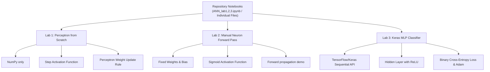

# Artificial Neural Networks (ANN) & Deep Learning Lab
## Comprehensive Viva Preparation Guide: Labs 1, 2, and 3

This repository contains the Jupyter Notebooks demonstrating the evolution of neural networks from a single Perceptron built from scratch to a manual single-neuron forward-pass model, and finally to a Feedforward Neural Network (FNN) built with TensorFlow/Keras:
- Combined Notebook: [ANN_lab1,2,3.ipynb](file:///Users/mastersam/Documents/5BDA/ANN&DL/code/ANN_lab1,2,3.ipynb)
- Individual Lab 1 Notebook: [ANN_lab1.ipynb](file:///Users/mastersam/Documents/5BDA/ANN&DL/code/ANN_lab1.ipynb)
- Individual Lab 2 Notebook: [ANN_lab2.ipynb](file:///Users/mastersam/Documents/5BDA/ANN&DL/code/ANN_lab2.ipynb)
- Individual Lab 3 Notebook: [ANN_lab3.ipynb](file:///Users/mastersam/Documents/5BDA/ANN&DL/code/ANN_lab3.ipynb)

All three labs use the logical **AND gate** as the dataset.

Use this README as your complete study guide for the viva. It covers the underlying theory, mathematical formulas, manual step-by-step calculations, line-by-line code explanations, and a curated list of expected viva questions.

---

## 📌 Table of Contents
1. [Notebook Overview](#-notebook-overview)
2. [Lab 1: Simulate a Perceptron using NumPy](#-lab-1-simulate-a-perceptron-using-numpy)
   - [Theoretical Foundations](#lab-1-theoretical-foundations)
   - [Mathematical Formula & Learning Rule](#lab-1-mathematical-formula--learning-rule)
   - [Code Breakdown](#lab-1-code-breakdown)
3. [Lab 2: Manual Single Neuron Model (Sigmoid Activation)](#-lab-2-manual-single-neuron-model-sigmoid-activation)
   - [Theoretical Foundations](#lab-2-theoretical-foundations)
   - [Mathematical Formula](#lab-2-mathematical-formula)
   - [Manual Step-by-Step Hand Calculations](#lab-2-manual-step-by-step-hand-calculations)
   - [Code Breakdown](#lab-2-code-breakdown)
4. [Lab 3: Feedforward Neural Network (TensorFlow/Keras)](#-lab-3-feedforward-neural-network-tensorflowkeras)
   - [Theoretical Foundations](#lab-3-theoretical-foundations)
   - [Network Architecture & Parameter Calculations](#lab-3-network-architecture--parameter-calculations)
   - [Loss Function & Optimizer](#lab-3-loss-function--optimizer)
   - [Code Breakdown](#lab-3-code-breakdown)
5. [🎓 The Ultimate Viva Q&A (20+ Cracking Questions)](#-the-ultimate-viva-qa-20-cracking-questions)

---

## 🗺️ Notebook Overview

The notebook demonstrates three distinct paradigms of implementing neural network concepts:



---

## 🧠 Lab 1: Simulate a Perceptron using NumPy

### Lab 1: Theoretical Foundations
A **Perceptron** is the simplest form of an Artificial Neural Network, introduced by Frank Rosenblatt in 1958. It acts as a **linear binary classifier**. 
- It takes a vector of inputs, multiplies them by weights, adds a bias, and passes the result through a step activation function to output a `0` or `1`.
- **Limitation**: The Perceptron can only classify **linearly separable** datasets (where a single straight line/hyperplane can separate the classes). The logical AND, OR, and NAND gates are linearly separable. The logical XOR and XNOR gates are **not** linearly separable.

### Lab 1: Mathematical Formula & Learning Rule
1. **Weighted Sum ($z$):**
   $$z = \mathbf{w} \cdot \mathbf{x} + b = \sum_{i=1}^{n} w_i x_i + b$$
   Where $\mathbf{x} = [x_1, x_2, \dots, x_n]^T$ is the input vector, $\mathbf{w} = [w_1, w_2, \dots, w_n]$ is the weight vector, and $b$ is the bias.

2. **Step Activation Function ($f(z)$):**
   $$y = f(z) = \begin{cases} 1 & \text{if } z \ge 0 \\ 0 & \text{if } z < 0 \end{cases}$$

3. **Perceptron Learning Update Rule:**
   For every training sample, if the predicted output $\hat{y}$ differs from the target output $y$, the error $e$ is calculated:
   $$e = y - \hat{y}$$
   The weights and bias are updated using:
   $$w_j \leftarrow w_j + \eta \cdot e \cdot x_j$$
   $$b \leftarrow b + \eta \cdot e$$
   Where $\eta$ is the **learning rate** (typically a small value between $0.01$ and $0.1$).

### Lab 1: Code Breakdown

* **Step Function:**
  ```python
  def step_function(x):
      if x >= 0:
          return 1
      return 0
  ```
  Returns `1` if the net input is non-negative, else `0`.

* **Constructor (`__init__`):**
  ```python
  def __init__(self, input_size, learning_rate=0.1):
      self.weights = np.zeros(input_size)
      self.bias = 0
      self.learning_rate = learning_rate
  ```
  Initializes the weight vector to zeros of length `input_size` (which is $2$ for two inputs), bias to $0$, and sets the learning rate to $0.1$.

* **Prediction (`predict`):**
  ```python
  def predict(self, x):
      total = np.dot(x, self.weights) + self.bias
      return step_function(total)
  ```
  Performs the forward computation (dot product $\mathbf{w} \cdot \mathbf{x}$ plus bias $b$) and applies the step function.

* **Training (`train`):**
  ```python
  def train(self, X, y, epochs=10):
      for _ in range(epochs):
          for inputs, target in zip(X, y):
              prediction = self.predict(inputs)
              error = target - prediction
              self.weights += self.learning_rate * error * inputs
              self.bias += self.learning_rate * error
  ```
  Iterates over the dataset for a given number of `epochs`. For each sample, it computes the error and adjusts the weights and bias. If the prediction is correct ($error = 0$), no update happens.

---

## 🔢 Lab 2: Manual Single Neuron Model (Sigmoid Activation)

### Lab 2: Theoretical Foundations
This lab implements **forward propagation** manually. Instead of training, it uses **pre-defined weights and bias** to show how a single neuron computes the outputs for an AND gate. 
- It replaces the discontinuous Step function with a continuous, differentiable **Sigmoid activation function**.
- Sigmoid outputs a real value in the range $(0, 1)$, which represents the probability of the input belonging to class `1`.

### Lab 2: Mathematical Formula
1. **Weighted Sum ($z$):**
   $$z = w_1 x_1 + w_2 x_2 + b$$
2. **Sigmoid Activation Function ($\sigma(z)$):**
   $$\sigma(z) = \frac{1}{1 + e^{-z}}$$
3. **Thresholding (Classification):**
   $$\text{Class} = \begin{cases} 1 & \text{if } \sigma(z) \ge 0.5 \\ 0 & \text{if } \sigma(z) < 0.5 \end{cases}$$

### Lab 2: Manual Step-by-Step Hand Calculations
Given parameters in the code:
- Weights: $w_1 = 0.5$, $w_2 = 0.5$
- Bias: $b = -0.7$

| Input ($x_1, x_2$) | Weighted Sum ($z = 0.5x_1 + 0.5x_2 - 0.7$) | Sigmoid Activation ($\sigma(z) = \frac{1}{1 + e^{-z}}$) | Predicted Class ($\ge 0.5$) |
| :--- | :--- | :--- | :--- |
| **[0, 0]** | $0(0.5) + 0(0.5) - 0.7 = \mathbf{-0.7}$ | $\frac{1}{1 + e^{0.7}} = \frac{1}{1 + 2.01375} = \mathbf{0.3318}$ | **0** (since $0.3318 < 0.5$) |
| **[0, 1]** | $0(0.5) + 1(0.5) - 0.7 = \mathbf{-0.2}$ | $\frac{1}{1 + e^{0.2}} = \frac{1}{1 + 1.22140} = \mathbf{0.4502}$ | **0** (since $0.4502 < 0.5$) |
| **[1, 0]** | $1(0.5) + 0(0.5) - 0.7 = \mathbf{-0.2}$ | $\frac{1}{1 + e^{0.2}} = \frac{1}{1 + 1.22140} = \mathbf{0.4502}$ | **0** (since $0.4502 < 0.5$) |
| **[1, 1]** | $1(0.5) + 1(0.5) - 0.7 = \mathbf{0.3}$ | $\frac{1}{1 + e^{-0.3}} = \frac{1}{1 + 0.74082} = \mathbf{0.5744}$ | **1** (since $0.5744 \ge 0.5$) |

### Lab 2: Code Breakdown

* **Sigmoid Function:**
  ```python
  def sigmoid(x):
      return 1 / (1 + np.exp(-x))
  ```
  Computes the sigmoid formula using NumPy's vectorized exponentiation.

* **Parameters & Inference Loop:**
  ```python
  weights = np.array([0.5, 0.5])
  bias = -0.7

  for x in X:
      z = np.dot(x, weights) + bias
      output = sigmoid(z)
      prediction = 1 if output >= 0.5 else 0
      print(f"Input: {x}, Weighted Sum = {z:.2f}, Output = {output:.4f}, Class = {prediction}")
  ```
  Runs the calculations shown in the table and prints the formatted inputs, intermediate weighted sums, raw probabilities, and final predicted classes.

---

## ⚡ Lab 3: Feedforward Neural Network (TensorFlow/Keras)

### Lab 3: Theoretical Foundations
This lab uses **TensorFlow & Keras** to build a Multi-Layer Perceptron (MLP) consisting of:
- **Input layer**
- **Hidden layer** (to introduce non-linearity and learn high-level representations)
- **Output layer**
The network learns the weights and biases through the backpropagation algorithm using stochastic gradient descent (via the Adam optimizer).

### Lab 3: Network Architecture & Parameter Calculations
The model is structured as:
1. **Input Layer**: Shape `(2,)` (representing two inputs).
2. **Hidden Layer**: $4$ neurons, **ReLU** activation.
3. **Output Layer**: $1$ neuron, **Sigmoid** activation.

```
       [Input 1] -------\      /---> [H1 (ReLU)] ---\
                         \    /----> [H2 (ReLU)] ----\
                          \  /-----> [H3 (ReLU)] -----\
       [Input 2] ----------X-------> [H4 (ReLU)] ------+---> [Output (Sigmoid)]
```

#### Trainable Parameters Calculation (Examiners LOVE this!):
* **Input Layer $\rightarrow$ Hidden Layer:**
  - Weights: $2 \text{ inputs} \times 4 \text{ hidden neurons} = 8$ weights
  - Biases: $1 \text{ bias per hidden neuron} = 4$ biases
  - Parameters in Hidden Layer = $8 + 4 = 12$
* **Hidden Layer $\rightarrow$ Output Layer:**
  - Weights: $4 \text{ hidden neurons} \times 1 \text{ output neuron} = 4$ weights
  - Biases: $1 \text{ bias per output neuron} = 1$ bias
  - Parameters in Output Layer = $4 + 1 = 5$
* **Total Trainable Parameters:** $12 + 5 = 17$ parameters.

### Lab 3: Loss Function & Optimizer
1. **Binary Cross-Entropy Loss:**
   Since this is a binary classification problem, the binary cross-entropy loss function is minimized:
   $$\mathcal{L} = -\frac{1}{N} \sum_{i=1}^{N} \left[ y_i \log(\hat{y}_i) + (1 - y_i) \log(1 - \hat{y}_i) \right]$$
   Where $y_i$ is the actual binary class ($0$ or $1$) and $\hat{y}_i$ is the predicted probability output by the output layer's sigmoid activation.

2. **Adam Optimizer:**
   Adaptive Moment Estimation. It dynamically scales the learning rate for each weight based on the running average of the first moment (mean) and second moment (uncentered variance) of the gradients.

### Lab 3: Code Breakdown

* **Model Definition:**
  ```python
  model = Sequential([
      Input(shape=(2,)),
      Dense(4, activation='relu'),
      Dense(1, activation='sigmoid')
  ])
  ```
  - `Sequential` establishes a linear stack of layers.
  - `Input(shape=(2,))` specifies that input samples have 2 features.
  - `Dense(4, activation='relu')` creates a fully connected layer with 4 nodes. ReLU ($f(x) = \max(0, x)$) is used to avoid vanishing gradients and inject non-linearity.
  - `Dense(1, activation='sigmoid')` creates the output layer with 1 node returning a value in $(0, 1)$.

* **Compilation:**
  ```python
  model.compile(
      optimizer='adam',
      loss='binary_crossentropy',
      metrics=['accuracy']
  )
  ```
  Configures training parameters (Adam optimizer, Cross-Entropy loss, tracking accuracy).

* **Training (`fit`):**
  ```python
  model.fit(X, y, epochs=500, verbose=0)
  ```
  Trains the model over $500$ epochs. `verbose=0` suppresses printing epoch logs, saving visual space.

* **Prediction:**
  ```python
  predictions = model.predict(X)
  for i in range(len(X)):
      print(f"Input: {X[i]} => Predicted: {predictions[i][0]:.4f} => Class: {int(predictions[i][0] >= 0.5)}")
  ```
  Performs inference on training data. Output predictions are floating point probabilities. `predictions[i][0] >= 0.5` converts the probability to a binary class ($0$ or $1$).

---

## 🎓 The Ultimate Viva Q&A (20+ Cracking Questions)

### Q1: What is the main objective of these three labs?
**Answer:** The objective is to demonstrate the evolution of learning models. 
1. **Lab 1** builds a single Perceptron from scratch using NumPy to show how weights are adjusted using target-prediction differences and a step function.
2. **Lab 2** demonstrates manual forward-propagation through a single neuron using fixed weights and a smooth, continuous Sigmoid activation function.
3. **Lab 3** implements a complete Multi-Layer Perceptron (MLP) with a hidden layer and backpropagation using TensorFlow/Keras to solve the same classification problem.

### Q2: What is a Perceptron, and who introduced it?
**Answer:** The Perceptron is the simplest type of artificial neural network that acts as a linear classifier. It was invented by Frank Rosenblatt in 1958. It calculates a weighted sum of inputs plus a bias and applies a step function to output a binary decision.

### Q3: What is the significance of the bias parameter ($b$)?
**Answer:** The bias shifts the activation function along the x-axis. Mathematically, it determines the threshold at which the neuron fires. Without a bias ($b = 0$), the decision boundary would be forced to pass directly through the origin $(0,0)$, which severely limits the classifier's flexibility.

### Q4: Why is it that the Perceptron in Lab 1 can solve the AND gate but cannot solve the XOR gate?
**Answer:** The AND gate is **linearly separable**, meaning we can draw a single straight line on a 2D plane to separate the $0$ outputs from the $1$ outputs. The XOR gate is **non-linearly separable**; its outputs cannot be divided by a single straight line. A single Perceptron can only create linear decision boundaries, hence it fails on XOR.

### Q5: Prove mathematically why a single Perceptron cannot solve the XOR gate.
**Answer:** 
Let the perceptron decision rule be: $y = 1$ if $w_1 x_1 + w_2 x_2 + b \ge 0$, and $y = 0$ otherwise.
For XOR inputs, we require:
1. For $[0, 0] \rightarrow y = 0 \implies b < 0$
2. For $[1, 1] \rightarrow y = 0 \implies w_1 + w_2 + b < 0$
3. For $[0, 1] \rightarrow y = 1 \implies w_2 + b \ge 0$
4. For $[1, 0] \rightarrow y = 1 \implies w_1 + b \ge 0$

If we add equations (3) and (4), we get:
$$w_1 + w_2 + 2b \ge 0$$
Using equation (1) ($b < 0$), we can write:
$$w_1 + w_2 + b > w_1 + w_2 + 2b$$
Since $w_1 + w_2 + 2b \ge 0$, this implies:
$$w_1 + w_2 + b > 0$$
But this directly contradicts equation (2) ($w_1 + w_2 + b < 0$). Since no such weights and bias can exist, a single perceptron cannot represent the XOR function.

### Q6: Why do we initialize weights to `np.zeros(input_size)` in Lab 1? Is zero initialization always acceptable?
**Answer:** In a single Perceptron, zero initialization is acceptable because there is only one neuron, and its weights will update during the training process as long as errors occur. 
However, in **deep multi-layer networks**, initializing all weights to zero causes the **symmetry breaking problem**: all neurons in a hidden layer learn the exact same features because they receive the same gradients. Therefore, multi-layer networks require random initialization (e.g., Xavier/Glorot or He initialization).

### Q7: What is the role of the learning rate ($\eta$)? What happens if it is too high or too low?
**Answer:** The learning rate controls the size of weight adjustments at each training step.
- **Too high:** The model updates weights too aggressively, causing the loss to oscillate or diverge, missing the global minimum entirely.
- **Too low:** The model makes tiny updates, leading to extremely slow convergence and potentially getting trapped in local minima.

### Q8: Compare Step, Sigmoid, and ReLU activation functions.
**Answer:**
- **Step Function:** $f(x) = 1$ if $x \ge 0$ else $0$. Output range is $\{0, 1\}$. It is discontinuous and non-differentiable at $0$, meaning it cannot be used with gradient descent-based backpropagation.
- **Sigmoid Function:** $\sigma(x) = \frac{1}{1 + e^{-x}}$. Output range is $(0, 1)$. It is smooth, continuous, and differentiable. It is useful for binary classification output layers to represent probabilities.
- **ReLU (Rectified Linear Unit):** $f(x) = \max(0, x)$. Output range is $[0, \infty)$. It is linear for positive values and zero for negative values. It is computationally highly efficient and mitigates the vanishing gradient problem.

### Q9: Why is the step activation function not used in deep learning / backpropagation?
**Answer:** Backpropagation relies on **gradient descent**, which uses derivatives to compute how changes in weights affect the loss function. The derivative of a step function is $0$ everywhere and undefined at $x = 0$. Since the gradient is $0$, weights cannot be adjusted using gradient descent.

### Q10: How does a Sigmoid activation function lead to the "vanishing gradient" problem?
**Answer:** The derivative of the Sigmoid function is $\sigma'(x) = \sigma(x)(1 - \sigma(x))$. The maximum value of this derivative is $0.25$ (when $x = 0$). When backpropagating through many layers, we multiply these gradients. Multiplying multiple numbers less than $0.25$ causes the gradient to decrease exponentially toward zero. As a result, the early layers of the network learn extremely slowly or stop training altogether.

### Q11: Explain the calculations in Lab 2. How did we get an output of 0.5744 for input [1,1]?
**Answer:** 
- The weighted sum is $z = (1 \times 0.5) + (1 \times 0.5) - 0.7 = 0.3$.
- The activation is $\sigma(0.3) = \frac{1}{1 + e^{-0.3}} = \frac{1}{1 + 0.7408} = 0.5744$.
- Since $0.5744 \ge 0.5$, it thresholded to Class 1.

### Q12: Why does Lab 3 require a hidden layer if an AND gate can be solved by a single perceptron?
**Answer:** While a single neuron is mathematically sufficient to solve the AND gate, Lab 3 serves as an educational bridge to multi-layer architectures. It demonstrates how to compile and train a Multi-Layer Perceptron (MLP) in Keras, showing that even with a hidden layer, the network successfully converges to the correct decision boundary.

### Q13: What does the code `Input(shape=(2,))` mean in Keras?
**Answer:** It defines the input layer of the network. It tells Keras that the network should expect inputs as a 2D tensor where each sample has $2$ features (columns). The number of rows (batch size) is left flexible.

### Q14: How many trainable parameters are there in the Keras model of Lab 3? Show the breakdown.
**Answer:** There are **17 trainable parameters**:
1. **Input to Hidden Layer (Dense with 4 units):**
   - Weights: $2 \text{ inputs} \times 4 \text{ neurons} = 8$ weights.
   - Biases: $4$ biases.
   - Total = $12$.
2. **Hidden to Output Layer (Dense with 1 unit):**
   - Weights: $4 \text{ inputs} \times 1 \text{ neuron} = 4$ weights.
   - Biases: $1$ bias.
   - Total = $5$.
3. **Grand Total:** $12 + 5 = 17$ parameters.

### Q15: Why is Binary Cross-Entropy used as the loss function in Lab 3 instead of Mean Squared Error (MSE)?
**Answer:** Binary Cross-Entropy is mathematically derived from Maximum Likelihood Estimation for binary classification. 
- It penalizes confident wrong predictions exponentially, resulting in steep gradients that speed up training.
- MSE, when paired with a sigmoid activation, suffers from **gradient saturation** because the sigmoid derivative is close to zero for very high/low inputs, leading to slow training convergence.

### Q16: What is the Adam optimizer, and why is it preferred over standard SGD?
**Answer:** Adam (Adaptive Moment Estimation) combines the principles of **Momentum** (keeps moving in the direction of previous updates to damp oscillations) and **RMSProp** (scales learning rates based on the recent magnitude of gradients to balance progress across parameters). It maintains running averages of both the gradients (first moment) and the second moment (uncentered variance) of the gradients. It converges faster and requires less manual tuning of the learning rate.

### Q17: What does the parameter `epochs=500` mean? Is training a model for 500 epochs on 4 samples overfitting?
**Answer:** An epoch is one complete pass of the entire training dataset through the neural network.
- Training 500 epochs on a simple AND gate is a minor computational task taking less than a second. 
- While 500 epochs is far more than needed for convergence, the risk of overfitting is negligible here because the AND gate dataset represents the entire possible domain ($2^2 = 4$ combinations). There are no unseen test configurations to overfit to, and the loss will simply settle near its global minimum.

### Q18: What is the significance of the `dtype=np.float32` argument in the inputs of Lab 3?
**Answer:** Neural network operations in frameworks like TensorFlow and PyTorch are optimized for 32-bit floating-point numbers (`float32`). While Python uses 64-bit floats (`float64`) by default, 32-bit floats require half the memory and provide significantly higher computational throughput on hardware accelerators like GPUs and TPUs.

### Q19: In Lab 3, the predictions output values like 0.3909 and 0.5085 instead of exact 0s and 1s. Why?
**Answer:** The output layer uses a **Sigmoid** activation function, which returns a continuous value representing the predicted probability $P(y=1|x)$. It will rarely output exactly $0.0$ or $1.0$ unless the weights are extremely large. During inference, we apply a threshold of $0.5$: any probability $\ge 0.5$ is classified as $1$, and any probability $< 0.5$ is classified as $0$.

### Q20: What is the difference between batch gradient descent, stochastic gradient descent (SGD), and mini-batch gradient descent?
**Answer:**
- **Batch Gradient Descent:** Computes the gradient of the loss function over the *entire* training dataset before updating the weights once. It is stable but slow on large datasets.
- **Stochastic Gradient Descent (SGD):** Updates the weights after analyzing *each individual* training sample. It is fast and introduces noise that can help escape local minima, but its convergence path is highly erratic.
- **Mini-Batch Gradient Descent:** Updates weights after analyzing a small subset (batch size e.g., 32, 64, 128) of the dataset. It balances the stability of Batch Gradient Descent with the speed of SGD.

### Q21: What is Backpropagation? How does it differ from the update rule in Lab 1?
**Answer:** Backpropagation is an algorithm used to calculate the gradient of the loss function with respect to each weight in a multi-layer neural network by applying the mathematical **chain rule** backward from the output layer to the input layer.
- **Lab 1** does not use backpropagation. It uses the direct Perceptron learning rule, which updates weights based only on the immediate error of the single output node and does not need to distribute error gradients backward through multiple layers.
